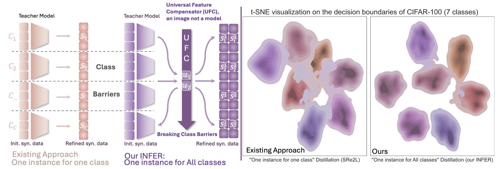
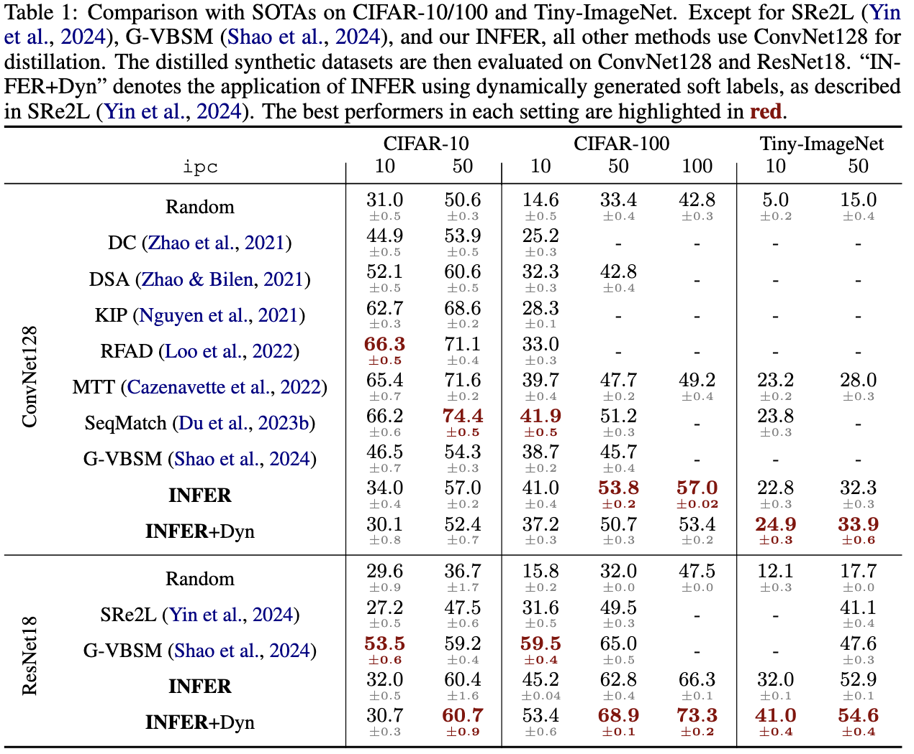
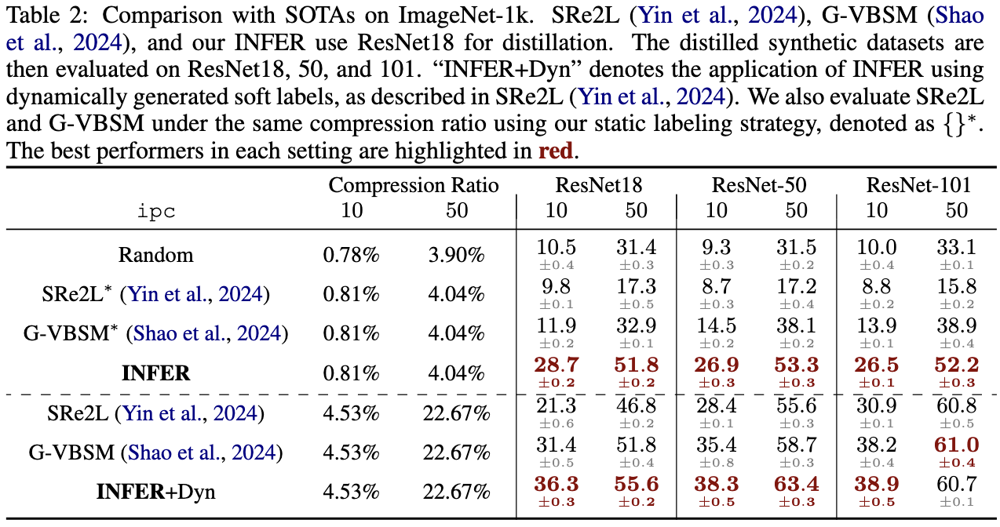

# 🌟 Breaking Class Barriers: Efficient Dataset Distillation via Inter-Class Feature Compensator
## 🔥 ICLR 2025 Poster 🔥

>[Breaking Class Barriers: Efficient Dataset Distillation via Inter-Class Feature Compensator](https://arxiv.org/abs/2408.06927).<br>
> [Xin Zhang](https://zhangxin-xd.github.io/), [Jiawei Du](https://scholar.google.com/citations?user=WrJKEzEAAAAJ&hl=zh-CN), [Ping Liu](https://pinglmlcv.github.io/pingliu264/), [Joey Tianyi Zhou](https://joeyzhouty.github.io/) <br>
> Agency for Science, Technology, and Research (ASTAR), Singapore <br>
> University of Nevada, Reno
## 📖 Introduction

<p align="justify">
<strong>Left</strong>: Overview of dataset distillation paradigms. The first illustrates the traditional ``one instance for one class'' approach, where each instance is optimized exclusively for its pre-assigned label, creating implicit class barriers. The second illustrates our INFER method, designed for ``one instance for ALL classes'' distillation. <strong>Right</strong>: t-SNE visualization of the decision boundaries between the traditional approaches (i.e., SRe2L) and our INFER approach. We randomly select seven classes from CIFAR-100 dataset for the visualization. INFER forms thin and clear decision boundaries among classes, in contrast to the chaotic decision boundaries of the traditional approach.</p>

---

## ⚙️ Installation

To get started, follow these instructions to set up the environment and install dependencies.

1. **Clone this repository**:
    ```bash
    git clone https://github.com/zhangxin-xd/UFC.git
    cd UFC
    ```

2. **Install required packages**:
   You don’t need to create a new environment; simply ensure that you have compatible versions of CUDA and PyTorch installed.
---

## 🚀 Usage

Here’s how to use this code for UFC generation and validation:
- **Preparation**
For ImageNet-1K, we use the pre-trained weights available in `torchvision`.  For CIFAR and Tiny-ImageNet, we provide the trained weights at this [link](https://drive.google.com/drive/folders/1dH96COYa4kCquQ4c6wEnt7QobGMl6M3N?usp=sharing).  Alternatively, you can train the models yourself by following the instructions in [Diversity-Driven-Synthesis](https://github.com/AngusDujw/Diversity-Driven-Synthesis).

- **Generation**:
    Before performing distillation, please first prepare the images by randomly sampling from the original dataset and saving them as tensors. We provide the tensor-formatted initialization images at this [link](https://drive.google.com/drive/folders/1ueAnTXOUGiQ_E9iIssNYmEBX4vlVQEDZ?usp=sharing) .

    Cifar:
    ```bash
    python ufc_generation/ufc_cifar.py \
        --iteration 1000 --r-bn 1 --batch-size 100 \
        --lr 0.25 --ipc 10 \
        --exp-name generated_results \
        --wandb-name cifar100-ipc10 \
        --store-best-images \
        --syn-data-path syn/ \
        --init_path init_images/c100/ \
        --dataset cifar100
    ```
    ImageNet-1K:
    ```bash
    python ufc_generation/ufc_imgnet.py \
        --iteration 2000 --r-bn 0.01 --batch-size 1000 \
        --lr 0.25 --ipc 10 \
        --exp-name generated_results \
        --wandb-name imagenet-ipc10 \
        --store-best-images \
        --syn-data-path syn/ \
        --init_path init_images/imagenet/ \
        --dataset imagenet
    ```
- **Evaluation**:
  validation with static labeling
    ```bash
    python ufc_validation/val_static.py \
        --epochs 400 --batch-size 64 --ipc 10 \
        --syn-data-path syn/cifar100-ipc10/generated_results \
        --output-dir syn/cifar100-ipc10/generated_results \
        --wandb-name cifar100-ipc10 \
        --dataset cifar100 --networks resnet18
    ```
    validation with dynamic labeling
  ```bash
    python ufc_validation/val_dyn.py \
        --epochs 80 --batch-size 64 --ipc 10 \
        --syn-data-path syn/cifar100-ipc10/generated_results\
        --output-dir syn/cifar100-ipc10 \
        --wandb-name cifar100-ipc10 \
        --dataset cifar100 --networks resnet18
    ```

we also provide the `.sh` script in the `scripts` directory.

---

## 📊 Results

Our experiments demonstrate the effectiveness of the proposed approach across various benchmarks. 

<div style="display: flex; justify-content: center; align-items: center;">
    
    
</div>

For detailed experimental results and further analysis, please refer to the full paper.

---

## 📑 Citation

If you find this code useful in your research, please consider citing our work:

```bibtex
@inproceedings{ufc2025iclr,
    title={Breaking Class Barriers: Efficient Dataset Distillation via Inter-Class Feature Compensator},
    author={Zhang, Xin and Du, Jiawei, and Liu, Ping and Zhou, Joey Tianyi},
    booktitle={Proc. Int. Conf. Learn. Represent. (ICLR)},
    year={2025}
}
```
---
## 🎉 Reference
Our code has referred to previous work:

[Squeeze, Recover and Relabel: Dataset Condensation at ImageNet Scale From A New Perspective](https://github.com/VILA-Lab/SRe2L)

